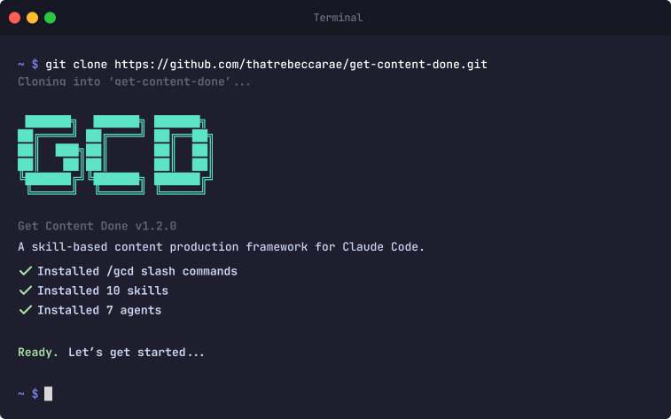

<div align="center">

# Get Content Done

**Sprint planning, two-gate quality, and performance feedback loops for content — powered by Claude Code skills.**

[](https://docs.anthropic.com/en/docs/claude-code)
[](https://linkedin.com/in/rebeccaraebarton)
[](https://x.com/rebeccarae)
[](https://github.com/thatrebeccarae/get-content-done/stargazers)
[](LICENSE)
[](https://github.com/thatrebeccarae/get-content-done)

<br>
<br>

```bash
git clone https://github.com/thatrebeccarae/get-content-done.git
```

<br>
<br>



<br>
<br>

[Why I Built This](#why-i-built-this) · [Who This Is For](#who-this-is-for) · [Getting Started](#getting-started) · [What It Does](#what-it-does) · [Skills](#skills) · [Agents](#agents) · [How It Works](#how-it-works) · [Extending GCD](#extending-gcd) · [Credits](#credits) · [Contributing](#contributing) · [License](#license)

</div>

---

## Why I Built This

Content production for solo builders is either chaotic or over-engineered. You're either dumping ideas into a Google Doc and hoping you remember to post, or wrangling a Notion database with 40 columns that nobody maintains. I wanted sprint methodology applied to content -- plan, produce, review, ship, retro -- with AI handling the parts it's good at (scoring, drafting, consistency checks) and humans handling the parts it's not (voice, judgment, "does this actually sound like me?").

## Who This Is For

- **Solo builders and creator-operators** who produce content across multiple platforms and need structure without a team
- **Content strategists** who want sprint methodology applied to content production, not just software
- **Claude Code users** who want a real-world skills + agents workflow they can extend and adapt
- **Obsidian and markdown-first writers** who refuse to move their content into another SaaS tool just to get a pipeline
- **Anyone publishing 3+ pieces per week** who needs quality gates, pillar enforcement, and performance feedback loops that actually close

## Getting Started

**Prerequisites:**

- [Claude Code](https://docs.anthropic.com/en/docs/claude-code) CLI installed and configured
- A markdown-based content store (Obsidian vault, flat files, whatever works)

**Install:**

```bash
git clone https://github.com/thatrebeccarae/get-content-done.git
cd get-content-done
./install.sh
```

**Configure:**

1. Copy `pillars.example.json` to your repo as `pillars.json`
2. Edit pillar names, posting days, keywords, and content types to match your strategy
3. Update vault paths in skill files to point to your content directories
4. Add signal briefs to your vault's inbox (manually via `/seed-idea` or from any source)
5. Run `/gcd:plan-sprint` to kick off your first sprint

<details>
<summary><strong>Path configuration</strong></summary>

Skills and agents reference three path categories that you'll need to update:

| Path | Default | What it points to |
|------|---------|-------------------|
| Repo path | `~/your-repo/` | Where you cloned GCD (for `pillars.json`, schemas, retros) |
| Content path | `~/your-vault/content/` | Where your content files live |
| Brief path | `~/your-vault/briefs/` | Where signal briefs are stored |

Search for these paths in the skill and agent `.md` files and replace with your actual paths.

</details>

## What It Does

GCD applies sprint methodology to content production. You define your content pillars, feed in signal briefs, and run a weekly cycle: **plan → produce → review → approve → retro**. Each step is a Claude Code slash command, and the planning step can also run autonomously via the morning pipeline (auto-assigning top briefs by impact score when no sprint-assigned stubs exist). Each piece of content tracks its own state in YAML frontmatter. Nothing moves directories. Nothing slips through the cracks.

**State layer** — `pillars.json` defines your content pillars, posting schedule, and quality gates. YAML frontmatter on every content file tracks lifecycle status. Files never move; status lives in frontmatter only.

**Scoring engine** — `analyze_content.py` scores every draft on a 5-category, 100-point scale before it reaches a human reviewer. Drafts that read like AI never make it past the auto-gate.

**Content templates** — 17 templates across LinkedIn, Substack, and adapted formats. Each template includes mandatory information gain markers (`[PERSONAL EXPERIENCE]`, `[ORIGINAL DATA]`, `[UNIQUE INSIGHT]`) that the producer must use instead of fabricating first-person content. Zero tolerance for invented anecdotes or fake metrics.

**Skills + agents** — 10 Claude Code skills orchestrate the workflow. 7 specialized agents handle scoring, drafting, review, research, and analytics. You interact through slash commands; agents do the heavy lifting behind each one.

## Skills

| Skill | Function |
|-------|----------|
| `/gcd:status` | Sprint dashboard — pieces, pillar coverage, velocity trends, bottleneck detection |
| `/gcd:queue` | Signal brief queue with composite scoring and pillar-fit suggestions |
| `/gcd:plan-sprint` | Interactive sprint planning with agent-scored recommendations and pillar enforcement |
| `/gcd:produce` | Route-dispatched content drafting (LinkedIn, Substack essay, Twitter/X thread, newsletter) |
| `/gcd:review` | Editorial review (Gate 1) — auto-gates on `analyze_content.py` scoring thresholds, then invokes agent for editorial judgment |
| `/gcd:approve` | Human approval (Gate 2) — only pieces with `reviewed` status can be approved |
| `/gcd:reject` | Reject a draft with feedback — preserves `.draft.md` for anti-pattern learning |
| `/gcd:retro` | Sprint close with pipeline metrics, engagement analysis, and performance feedback loop |
| `/seed-idea` | Capture a manual content idea as a brief stub |
| `/write-from-signal` | Convert a signal brief into a finished draft via a separate agent chain (research-analyst → content-marketer → editor-in-chief → social-amplifier) with user gates between stages |

## Agents

| Agent | Role |
|-------|------|
| `gcd-sprint-planner` | Scores briefs against pillars using composite formula (keyword 50% + pillar fit 30% + route fit 20%), detects strategy drift, applies performance boosts from historical data |
| `gcd-producer` | Template-aware drafting by route — selects from 17 content templates, enforces information gain markers, runs 5-point voice validation before save. Reads voice guide before every piece. |
| `gcd-reviewer` | Editorial review — invoked by `/gcd:review` after auto-gate passes. Receives `analyze_content.py` scorecard as context, focuses on subjective editorial judgment: voice consistency, structure, hook quality (A/B/C/D grading), SEO criteria, template adherence, marker validation. Returns pass/revise/escalate. Critique only — never rewrites. |
| `gcd-researcher` | Topic research for essay route — consumes RSS feeds and web sources, produces structured research briefs with data points, counter-arguments, and content angles |
| `gcd-amplifier` | Cross-platform distribution — generates LinkedIn posts, Twitter threads, email subject lines, and pull quotes from finished content |
| `gcd-metrics-analyst` | Pipeline analytics — throughput rates, gate performance, route comparison, high/low performer identification |
| `gcd-strategy-auditor` | Strategy health — rolling-window pillar drift detection, 3-sprint velocity trends, pipeline bottleneck identification |

## How It Works

### Content Lifecycle

YAML frontmatter is the single source of truth. Each piece moves through a defined lifecycle:

```
stub → draft → reviewed → approved → published → measured
                   ↑          |
                   └──────────┘  (revise loop)

              draft/reviewed → rejected  (terminal, preserved for learning)
```

### Sprint Planning

The `gcd-sprint-planner` agent scores signal briefs using a composite formula: keyword match (50%) + pillar fit with underrepresentation boost (30%) + route fit (20%). Historical performance data applies boosts to high-performing route+pillar combinations (+0.1) and gentle penalties to underperformers (-0.05). A 4-week rolling window detects pillar drift — if you haven't posted about a topic in two weeks, the planner surfaces it without hard-blocking.

### Template-Aware Drafting

`/gcd:produce` selects from 17 content templates before drafting. The producer reads the template library, picks the best match for the brief's angle and topic, then follows the template's structure, section order, and marker placement exactly. The template is the outline — no improvisation.

Templates include mandatory **information gain markers** where the producer cannot write from documented experience:
- `[PERSONAL EXPERIENCE: description]` — first-person stories only the author can tell
- `[ORIGINAL DATA: description]` — proprietary metrics, test results, cost comparisons
- `[UNIQUE INSIGHT: description]` — original analysis or contrarian take beyond source material

A draft with honest markers is always better than a draft with fabricated experiences. The producer runs a 5-point voice validation (rhythm, specificity, AI tells, pivot & close, voice drift) before saving.

Route dispatch:
- **LinkedIn post** — selects from 5 LinkedIn templates (build-log, contrarian-take, career-reframe, stop-paying-for-x, personality-micro) or adapted templates
- **Substack essay** — research phase via `gcd-researcher`, then draft via `gcd-producer` using Substack templates (thought-leadership, case-study, how-to-guide)
- **Twitter/X thread** — selects same template as LinkedIn, compresses for thread format
- **Newsletter** — section assembly from approved pieces + original drafted section

### Two-Gate Quality

**Gate 1 — `/gcd:review`** runs in two phases. First, `analyze_content.py` scores the draft on a 5-category, 100-point scale. Two metrics trigger auto-rejection before the agent is ever called: burstiness below 0.3 (sentences too uniform in length) or more than 5 banned AI phrases detected. If either threshold fails, the piece stays in `draft` status and the author gets specific feedback with line numbers. If the auto-gate passes, the `gcd-reviewer` agent receives the full scorecard and focuses on subjective editorial judgment — voice consistency, structure, hook quality grading (A/B/C/D), template adherence, marker validation, SEO criteria. The agent returns pass, revise, or escalate. On pass, the piece moves to `reviewed` status.

**Gate 2 — `/gcd:approve`** is pure human judgment. Only pieces with `reviewed` status can enter this gate. It catches what humans catch well — tone, judgment, relevance, "does this actually sound like me?" No agent is involved. Neither gate alone is enough. Both together cover the full surface.

<details>
<summary><strong>Scoring categories (analyze_content.py)</strong></summary>

| Category | Points | What it measures |
|----------|--------|------------------|
| Content Quality | 30 | Depth, readability, originality, structure, engagement, grammar |
| SEO Optimization | 20 | Heading structure, keyword placement, link tier classification |
| E-E-A-T Signals | 15 | Author experience patterns, citations, trust signals |
| AEO/GEO Readiness | 20 | Answer-first structure, citability, citation capsules, entities, FAQ sections |
| Anti-AI Detection | 15 | Burstiness (sentence length variation), banned phrases, type-token ratio, passive voice |

Scoring bands: 90-100 Exceptional, 80-89 Strong, 70-79 Acceptable, 60-69 Below Standard, <60 Rewrite.

The anti-AI category tracks 26 trigger words (delve, tapestry, multifaceted, testament, pivotal, robust, etc.) and 16 banned phrases ("in today's digital landscape," "game-changer," "revolutionize," etc.). Burstiness measures sentence length variation — uniform sentence length is a strong AI signal.

</details>

<details>
<summary><strong>Content templates (17 total)</strong></summary>

**LinkedIn (5):** build-log, contrarian-take, career-reframe, stop-paying-for-x, personality-micro

**Substack (3):** thought-leadership, case-study, how-to-guide

**Adapted (9):** comparison, data-research, faq-knowledge, listicle, news-analysis, pillar-page, product-review, roundup, tutorial

Each template defines section structure, required information gain markers with minimum counts, word count targets, and hook patterns. Templates live in your content strategy directory and can be customized or extended.

</details>

### Performance Feedback Loop

`/gcd:retro` closes the sprint with pipeline metrics and engagement analysis. The `gcd-metrics-analyst` identifies high and low performers by route and pillar. This data feeds back into the sprint planner — next week's scoring boosts what worked and nudges away from what didn't.

<details>
<summary><strong>Composite scoring formula</strong></summary>

The sprint planner scores each brief against each pillar:

```
composite = keyword_normalized * 0.5 + pillar_fit * 0.3 + route_fit * 0.2
```

Where:
- **keyword_normalized** (0.0-1.0): How many pillar keywords appear in the brief topic, divided by total keywords
- **pillar_fit** (0.0-1.0): keyword_normalized + underrepresentation boost (up to +0.3 for neglected pillars) + performance boost (+0.1/-0.05 from historical data)
- **route_fit** (0.0 or 1.0): Whether the brief's route matches the pillar's content types

Visual indicators in queue view:
- Score >= 0.6: strong signal
- Score 0.4-0.59: borderline
- Score < 0.4: weak signal

</details>

<details>
<summary><strong>Pillar enforcement and rolling windows</strong></summary>

The `pillars.json` config defines your content pillars with target posting frequencies. During sprint planning, the agent checks a 4-week rolling window of published content to calculate pillar coverage. If a pillar is underrepresented, the planner surfaces it as a suggestion — not a blocker. This keeps the system opinionated but flexible.

The enforcement config controls this behavior:
- `window_weeks`: How many weeks to look back (default: 4)
- `flag_missing_after_weeks`: When to start warning about a missing pillar (default: 2)
- `hard_block`: Whether to prevent sprint confirmation when a pillar is missing (default: false)

</details>

<details>
<summary><strong>Content state and frontmatter</strong></summary>

Every content file uses YAML frontmatter to track its current state. Files never move directories — status lives entirely in frontmatter. This means you can query your vault with Dataview, grep, or any tool that reads YAML to get a real-time view of your pipeline.

GCD adds these fields to your existing frontmatter (all optional for backwards compatibility):
- `sprint` — ISO week identifier (e.g., `2026-W08`)
- `piece_id` — Sprint-scoped ID (e.g., `W08-01`)
- `pillar` — Strategy pillar name from `pillars.json`
- `scheduled` — ISO 8601 datetime with timezone
- `brief_slug` — Links back to the originating signal brief
- `review_decision` — Gate 1 output (pass/revise/escalate)
- `engagement_metrics` — Nested platform-keyed metrics object
- `post_url` — Link to published post for metrics matching

See [`frontmatter-spec.md`](.planning/schemas/frontmatter-spec.md) for the complete specification.

</details>

## Extending GCD

GCD is the skill + agent + state layer. What feeds it — and what you do after `/gcd:approve` — is up to you.

Some things that pair well:
- **RSS scanning** for automated signal brief generation (Miniflux, Feedly, any reader with an API)
- **Scheduled pipelines** that run the brief queue before you wake up (cron, LaunchAgent, n8n, whatever)
- **Voice drift analysis** comparing AI drafts (`.draft.md`) against your published edits to build a living style guide
- **Engagement metrics sync** from platform data exports to close the feedback loop in `/gcd:retro`

None of these are required. GCD works with manual brief capture (`/seed-idea`) and manual metrics entry.

## Credits

GCD was directly inspired by [Get Shit Done (GSD)](https://github.com/gsd-build/get-shit-done), which applies sprint methodology and Claude Code skills to software engineering projects. GSD proved that skills + agents + structured state could replace heavyweight project management for solo builders. GCD takes the same philosophy — plan, execute, verify, retro — and adapts it for content production workflows.

The content template system and `analyze_content.py` scoring engine were inspired by [claude-blog](https://github.com/AgriciDaniel/claude-blog), which demonstrated automated content quality scoring and template-driven AI content production. The 5-category scoring model, information gain markers, and anti-AI detection heuristics were adapted from claude-blog's approach and extended for GCD's sprint-integrated pipeline.

## Contributing

Issues and PRs welcome. If you're adapting GCD for a different content workflow, I'd genuinely like to hear about it.

An active project and open-sourced as-is. Use it, adapt it, break it apart for pieces.

## License

MIT — see [LICENSE](LICENSE) for details.
